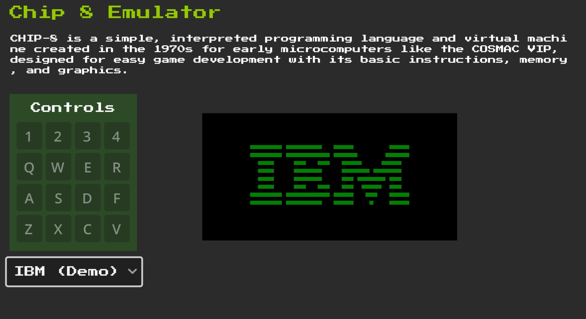
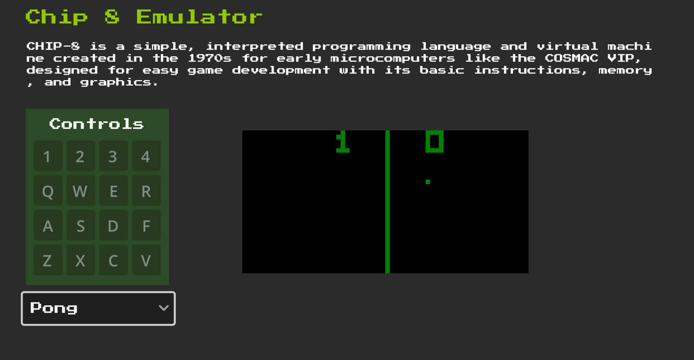
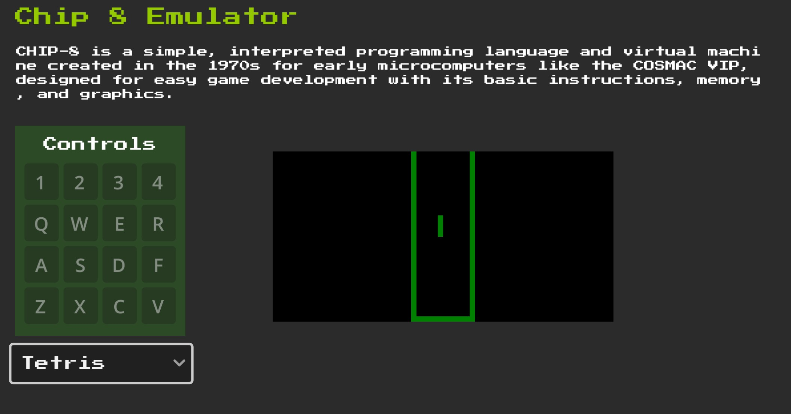
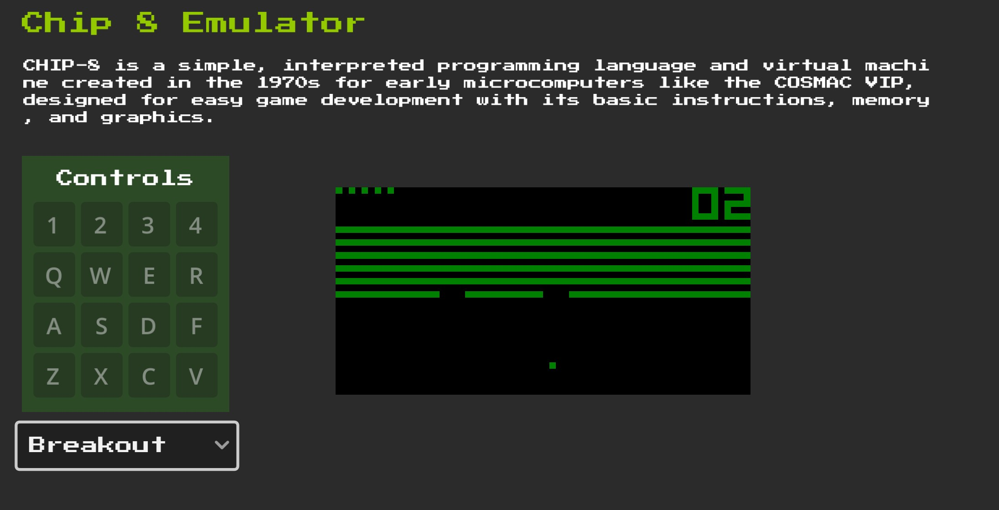

# Chip 8 Emulator

This project is implementation of Chip8 interpreter in Godot. Most of implementation follows technical specs mentioned in [Cowgod's Chip8 Technical Reference](http://devernay.free.fr/hacks/chip8/C8TECH10.HTM).

Try now: [Online](https://rahuldshetty.itch.io/chip-8-emulator-godot)

# Helpful Resources

- http://devernay.free.fr/hacks/chip8/C8TECH10.HTM
- https://tobiasvl.github.io/blog/write-a-chip-8-emulator/
- https://multigesture.net/articles/how-to-write-an-emulator-chip-8-interpreter/
- https://austinmorlan.com/posts/chip8_emulator/ (C++ Implementation)
- https://github.com/MetlHedd/godot-chip8 (Chip8 in Godot 3) 
